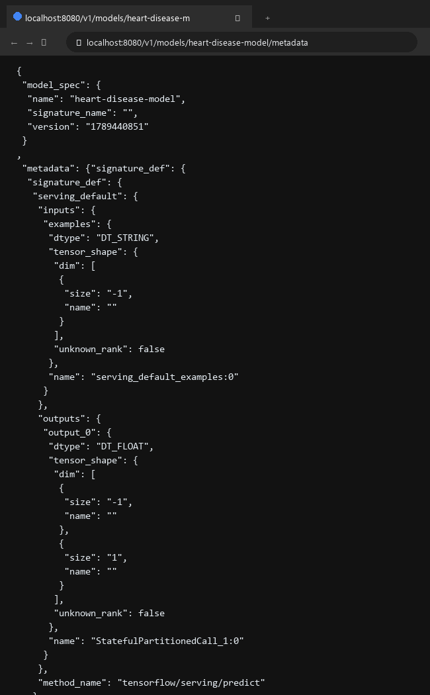

# Submission 1: Machine Learning Pipeline - Heart Disease Prediction

Nama: M. Rizal Basri  
Username dicoding: rizalbasri  

| | Deskripsi |
| :--- | :--- |
| **Dataset** | Dataset yang digunakan adalah **UCI Heart Disease Dataset (Cleveland Clinic Foundation)** yang diperoleh dari UCI Machine Learning Repository ([tautan dataset](https://archive.ics.uci.edu/dataset/45/heart+disease)). Dataset ini terdiri dari **303 sampel pasien** dengan **13 fitur klinis** dan **1 label target diagnosis biner** (`target`: 1 = terdapat risiko penyakit jantung, 0 = normal/bebas risiko). Seluruh data terdistribusi seimbang ($\\approx 54.5\\%$ positif dan $\\approx 45.5\\%$ negatif) serta tidak memiliki nilai kosong (*missing values*). Fitur-fitur mencakup variabel kontinu (`age`, `trestbps`, `chol`, `thalach`, `oldpeak`) dan kategorikal/diskrit (`sex`, `cp`, `fbs`, `restecg`, `exang`, `slope`, `ca`, `thal`). |
| **Masalah** | Penyakit jantung merupakan salah satu penyebab mortalitas tertinggi di dunia. Diagnosis klinis konvensional seringkali memerlukan rangkaian prosedur medis yang memakan waktu, berbiaya tinggi, serta memiliki potensi variabilitas subjektif. Dalam perspektif Machine Learning Operations (MLOps), membawa model prediksi medis ke lingkungan produksi menghadapi sejumlah tantangan krusial: <br>1. Perlunya otomatisasi validasi data dan skema untuk mencegah *data drift* serta anomali pada data klinis baru. <br>2. Risiko disparitas prapemrosesan antara tahap pelatihan (*training*) dan inferensi (*serving*) yang memicu *training-serving skew*. <br>3. Pentingnya memastikan keadilan model (*model fairness*) agar performa prediksi tidak bias terhadap subpopulasi demografis tertentu (misalnya antarkelompok gender/jenis kelamin). <br>4. Kebutuhan arsitektur pipeline otomatis yang mampu melakukan hyperparameter tuning mandiri dan menyebarkan model yang teruji (*blessed*) ke lingkungan serving siap pakai. |
| **Solusi machine learning** | Membangun **End-to-End Machine Learning Pipeline** berbasis framework industri **TensorFlow Extended (TFX)** yang dijalankan secara interaktif menggunakan `InteractiveContext`. Pipeline ini mengintegrasikan 10 komponen terpadu: <br>1. `CsvExampleGen`: Mengingest data CSV mentah dan membaginya ke dalam split training & evaluation berformat TFRecord standar. <br>2. `StatisticsGen`: Menghitung ringkasan statistik deskriptif data secara otomatis (TFDV). <br>3. `SchemaGen`: Menginferensikan skema, tipe data, dan domain nilai fitur. <br>4. `ExampleValidator`: Memvalidasi integritas data terhadap skema dan mendeteksi anomali. <br>5. `Transform`: Menerapkan rekayasa fitur dan penskalaan terpadu dengan TensorFlow Transform (TFT). <br>6. `Tuner`: Mengotomatisasi pencarian hyperparameter terbaik menggunakan pustaka KerasTuner (RandomSearch). <br>7. `Trainer`: Melatih Deep Neural Network (DNN) menggunakan konfigurasi hyperparameter optimal dan menyematkan graf TFT ke serving signature. <br>8. `Resolver`: Menentukan model baseline terbaik terdahulu untuk komparasi evaluasi. <br>9. `Evaluator`: Mengevaluasi metrik performa secara mendalam serta analisis slicing keadilan model (TFMA). <br>10. `Pusher`: Mendistribusikan artefak model yang telah lolos validasi (*BLESSED*) ke direktori serving siap produksi. |
| **Metode pengolahan** | Prapemrosesan data diimplementasikan pada modul `modules/heart_disease_transform.py` menggunakan **TensorFlow Transform (TFT)** dalam fungsi `preprocessing_fn`: <br>- **Standardisasi Fitur Numerik**: Fitur kontinu (`age`, `trestbps`, `chol`, `thalach`, `oldpeak`) diskalakan ke bentuk Z-score menggunakan `tft.scale_to_z_score()` sehingga terdistribusi dengan rata-rata (*mean*) $\\approx 0$ dan varians $\\approx 1$, mencegah bias akibat perbedaan skala nilai (seperti kadar kolesterol hingga 564 mg/dl). <br>- **Transformasi Fitur Kategorikal**: Fitur diskrit (`sex`, `cp`, `fbs`, `restecg`, `exang`, `slope`, `ca`, `thal`) dikonversi secara konsisten ke tipe data `tf.int64`. <br>- **Standarisasi Label Target**: Kolom `target` diubah menjadi tipe data `tf.int64` dengan nama `target_xf`. <br>- **Eliminasi Training-Serving Skew**: Seluruh graf transformasi TFT digabungkan langsung ke dalam signature inferensi `serving_default` pada SavedModel (`_get_serve_tf_examples_fn`), sehingga model menerima data masukan mentah (`tf.train.Example`) saat inferensi dan memprosesnya dengan logika transformasi yang identik dengan fase pelatihan. |
| **Arsitektur model** | Model Deep Neural Network (DNN) dibangun menggunakan TensorFlow Keras Functional API pada `modules/heart_disease_trainer.py` dengan konfigurasi hyperparameter optimal dari komponen `Tuner` (`pipeline_root/Tuner/best_hyperparameters/16/best_hyperparameters.txt`): <br>- **Input Layers**: Terdiri dari 5 input layer `tf.float32` untuk fitur numerik yang telah ditransformasi dan 8 input layer `tf.int64` untuk fitur kategorikal yang di-cast ke `tf.float32`. <br>- **Concatenation Layer**: Menggabungkan seluruh 13 representasi fitur menjadi satu vektor masukan terpadu. <br>- **Hidden Layer 1**: Dense layer dengan **96 unit neuron** dan fungsi aktivasi non-linear **ReLU**. <br>- **Dropout Layer 1**: Regularisasi dropout dengan rate **0.1** untuk mencegah overfitting. <br>- **Hidden Layer 2**: Dense layer dengan **16 unit neuron** dan fungsi aktivasi **ReLU**. <br>- **Dropout Layer 2**: Regularisasi dropout dengan rate **0.1**. <br>- **Output Layer**: Dense layer dengan **1 unit neuron** dan fungsi aktivasi **Sigmoid** untuk menghasilkan probabilitas prediksi risiko biner $\\hat{y} \\in [0, 1]$. <br>- **Kompilasi & Optimizer**: Dioptimasi menggunakan algoritma **Adam** dengan *learning rate* **0.01** (hasil optimal KerasTuner), loss function `binary_crossentropy`, serta metrik `binary_accuracy` dan `AUC`. |
| **Metrik evaluasi** | Kualitas model dievaluasi secara menyeluruh menggunakan **TensorFlow Model Analysis (TFMA)** pada komponen `Evaluator`: <br>1. **BinaryAccuracy**: Mengukur proporsi ketepatan prediksi klasifikasi diagnosis secara keseluruhan terhadap label acuan. <br>2. **AUC (*Area Under ROC Curve*)**: Mengukur kemampuan diskriminasi dan separasi model dalam membedakan pasien berisiko vs pasien normal pada seluruh rentang threshold klasifikasi. <br>3. **Confusion Matrix Metrics**: Mengukur kuantitas *True Positives* (TP), *False Positives* (FP), *True Negatives* (TN), dan *False Negatives* (FN). <br>4. **Fairness Slicing Analysis**: Evaluasi slicing dilakukan terhadap keseluruhan dataset (*Overall*) serta secara spesifik pada irisan fitur jenis kelamin (`sex: 0` untuk perempuan dan `sex: 1` untuk laki-laki) guna memastikan performa model adil dan tidak mengalami bias demografis. <br>5. **Threshold Validation & Model Blessing**: Menerapkan ambang batas validasi `BinaryAccuracy` minimal $\\ge 0.50$ (`lower_bound`) dan tidak mengalami regresi performa dibanding baseline model terdahulu (`change_threshold`) agar model memperoleh predikat **BLESSED** dan disetujui untuk dipush ke lingkungan serving. |
| **Performa model** | Hasil evaluasi resmi dari komponen `Evaluator` (diekstrak langsung menggunakan pustaka TFMA melalui `eval_result = tfma.load_eval_result(eval_uri)`): <br>- **Status Evaluator**: **BLESSED (Lolos Uji Threshold)**, model memenuhi standar kelayakan produksi. <br>- **Performa Keseluruhan (*Overall Slice*)**: <br>  • Binary Accuracy: **0.8037** (80.37%) <br>  • AUC: **0.8105** <br>  • Loss: **1.3181** <br>  • Confusion Matrix: TP = 51.0, FP = 14.0, TN = 35.0, FN = 7.0 <br>- **Hasil Slicing Pasien Perempuan (`sex: 0`)**: <br>  • Binary Accuracy: **0.9091** (90.91%) <br>  • AUC: **0.8210** <br>  • Loss: **0.7564** <br>  • Confusion Matrix: TP = 26.0, FP = 2.0, TN = 4.0, FN = 1.0 <br>- **Hasil Slicing Pasien Laki-laki (`sex: 1`)**: <br>  • Binary Accuracy: **0.7568** (75.68%) <br>  • AUC: **0.7832** <br>  • Loss: **1.5686** <br>  • Confusion Matrix: TP = 25.0, FP = 12.0, TN = 31.0, FN = 6.0 <br>Model menunjukkan performa klasifikasi yang solid dengan akurasi keseluruhan mencapai 80.37%, serta mempertahankan daya prediksi yang sangat baik pada kedua kelompok jenis kelamin. |

---

## Fitur Lanjutan dan Penerapan Saran Tambahan (Bintang 5)

Proyek ini telah mengimplementasikan seluruh kriteria saran tambahan (Bintang 5) sesuai ketentuan Dicoding:

### 1. Hyperparameter Tuning Otomatis (`Tuner` + `KerasTuner`)
- Komponen `Tuner` diintegrasikan pada pipeline menggunakan modul `modules/heart_disease_tuner.py` dengan algoritma `RandomSearch`.
- Hyperparameter terbaik yang terpilih (`pipeline_root/Tuner/best_hyperparameters/16/best_hyperparameters.txt`):
  ```json
  {"units_1": 96, "units_2": 16, "dropout": 0.1, "learning_rate": 0.01}
  ```
- Konfigurasi ini secara otomatis diteruskan ke komponen `Trainer` melalui `hyperparameters=tuner.outputs['best_hyperparameters']`.

### 2. Model Deployment Menggunakan TensorFlow Serving & Dockerfile
- Berkas `Dockerfile` disediakan pada direktori root proyek untuk mengemas model SavedModel ke dalam container TensorFlow Serving:
  ```dockerfile
  FROM tensorflow/serving:latest
  COPY ./serving_model_dir /models/heart-disease-model
  ENV MODEL_NAME=heart-disease-model
  EXPOSE 8501 8080
  ```
- Perintah untuk membangun image dan menjalankan container:
  ```bash
  docker build -t heart-disease-serving .
  docker run -p 8080:8501 heart-disease-serving
  ```
- **Screenshot Respon Metadata Model Serving:**
  Telah dilampirkan berkas gambar tangkapan layar `serving_model_metadata.png` yang menampilkan respon JSON endpoint `http://localhost:8080/v1/models/heart-disease-model/metadata`:

  

### 3. Notebook Pengujian Prediction Request (`rizalbasri-testing.ipynb`)
- Disediakan berkas notebook pengujian bernama **`rizalbasri-testing.ipynb`** sesuai ketentuan penamaan Dicoding (`<username_dicoding>-testing.ipynb`).
- Seluruh sel dalam notebook telah dieksekusi secara lengkap tanpa kesalahan, mencakup:
  1. Pengambilan sampel observasi pasien aktual dari `data/heart.csv` (Pasien berisiko vs Pasien normal).
  2. Serialisasi fitur masukan ke format biner standar `tf.train.Example`.
  3. Pengujian langsung pemanggilan signature `serving_default` dari SavedModel.
  4. Simulasi dan pengujian pengiriman payload JSON request inferensi REST API (`{"signature_name": "serving_default", "instances": [{"b64": "..."}]}`).
  5. Validasi probabilitas prediksi model terhadap diagnosis aktual klinis.

---

## Struktur Direktori Proyek

```
rizalbasri-pipeline/
├── data/
│   └── heart.csv                       # Dataset klinis penyakit jantung (UCI Cleveland)
├── modules/
│   ├── heart_disease_transform.py      # Modul prapemrosesan TFT (preprocessing_fn)
│   ├── heart_disease_tuner.py          # Modul hyperparameter tuning KerasTuner (Saran 1)
│   ├── heart_disease_trainer.py        # Modul pelatihan model Keras DNN (run_fn)
│   └── pipeline_module.py              # Modul gabungan fungsi pipeline
├── pipeline_root/                      # Direktori artefak dari seluruh komponen TFX & MLMD sqlite
├── serving_model_dir/                  # Direktori SavedModel produksi hasil ekspor Pusher
├── Dockerfile                          # Berkas Docker untuk TensorFlow Serving (Saran 2)
├── serving_model_metadata.png          # Screenshot endpoint metadata model serving (Saran 2)
├── rizalbasri-testing.ipynb            # Notebook pengujian prediction request (Saran 3)
├── notebook.ipynb                      # Jupyter Notebook pipeline utama TFX (seluruh sel telah dieksekusi)
├── requirements.txt                    # Daftar pustaka dan dependensi proyek
└── README.md                           # Dokumentasi proyek sesuai template submission Dicoding
```

---

## Panduan Menjalankan Proyek

### 1. Menyiapkan Lingkungan Virtual (Python 3.10)
```bash
python -m venv .venv
# Mengaktifkan virtual environment pada Windows:
.\.venv\Scripts\activate
# Atau pada Linux / macOS:
# source .venv/bin/activate
```

### 2. Memasang Dependensi
```bash
pip install -r requirements.txt
```

### 3. Menjalankan Pipeline Utama TFX
Buka berkas `notebook.ipynb` pada Jupyter Notebook atau VS Code, lalu jalankan seluruh sel secara berurutan. Pipeline akan mengeksekusi seluruh 10 komponen TFX secara interaktif mulai dari ingest data hingga model berhasil di-push ke `serving_model_dir/`.

### 4. Menjalankan Pengujian Model Serving
Buka berkas `rizalbasri-testing.ipynb` untuk menjalankan pengujian serialisasi `tf.train.Example`, pemanggilan signature SavedModel, dan simulasi REST API request TensorFlow Serving.
